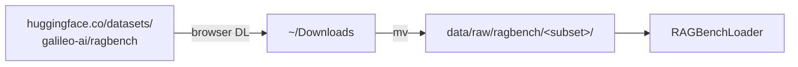

# Dev Setup & Usage

How to get the codebase running on a fresh machine, and the everyday commands you'll use during the capstone.

> **Corporate-network note:** if you're on a Zuora laptop (Zscaler proxy), follow the **Offline assets** section — the HuggingFace LFS CDN is intercepted and direct downloads will fail SSL. The repo is built to work around that.

---

## Prerequisites

| Tool        | Version         | How                                              |
|-------------|-----------------|--------------------------------------------------|
| Python      | 3.12 (3.11 ok)  | `uv venv --python 3.12` (recommended) or pyenv  |
| uv          | ≥ 0.4           | `brew install uv`                                |
| Ollama      | ≥ 0.1.40        | https://ollama.com (only if running locally)     |
| jq          | any             | `brew install jq` (handy for inspecting outputs) |

---

## First-time setup

```bash
# 1. Create venv with uv (auto-downloads Python 3.12 if needed)
uv venv --python 3.12 .venv
source .venv/bin/activate

# 2. Install package + dev deps
uv pip install -e ".[dev]"

# 3. Configure secrets
cp .env.example .env
# Edit .env — at minimum set HF_TOKEN. LLM provider keys only if not using Ollama.

# 4. Verify install
pytest -q              # expect: 14 passed
rag-kag --help         # expect: Typer help screen
```

---

## Offline assets (Zscaler workaround)

The Zuora laptop's Zscaler proxy MITMs `cdn-lfs.huggingface.co` and `cas-server.xethub.hf.co`. Solution: download these once on a non-corporate connection (or via browser), drop them into the repo, and the loader/embedder pick them up automatically.

### A) RAGBench parquet files



For each domain you need, browse to the corresponding subset and download the parquet:

| Subset       | Domain           | URL fragment                                |
|--------------|------------------|---------------------------------------------|
| covidqa      | biomedical       | `tree/main/covidqa`                         |
| pubmedqa     | biomedical       | `tree/main/pubmedqa`                        |
| hotpotqa     | general          | `tree/main/hotpotqa`                        |
| msmarco      | general          | `tree/main/msmarco`                         |
| cuad         | legal            | `tree/main/cuad`                            |
| emanual      | customer-support | `tree/main/emanual`                         |
| techqa       | customer-support | `tree/main/techqa`                          |
| finqa        | finance          | `tree/main/finqa`                           |
| tatqa        | finance          | `tree/main/tatqa`                           |
| (etc — see `RAGBenchLoader.SUBSET_TO_DOMAIN`)                                  |

Place each as `data/raw/ragbench/<subset>/<split>-XXXXX-of-YYYYY.parquet`. The loader finds them by glob.

### B) Embedder weights

Download the BAAI/bge-small-en-v1.5 repo (use Colab + `snapshot_download`, then copy to laptop):

```python
# Run this in Colab, then download the folder
from huggingface_hub import snapshot_download
snapshot_download(
    repo_id="BAAI/bge-small-en-v1.5",
    local_dir="/content/drive/MyDrive/models/bge-small-en-v1.5",
    local_dir_use_symlinks=False,
)
```

Copy the resulting folder to `models/bge-small-en-v1.5/`. The V1 config already references the relative path:

```yaml
embedder:
  model_name: models/bge-small-en-v1.5
```

Same pattern works for any sentence-transformers model — just update the YAML.

### C) Ollama models

These come through Ollama's own infra, not HF — Zscaler hasn't been observed to interfere.

```bash
ollama pull gemma4:e4b           # the V1 generator
ollama list                      # confirm
```

---

## Daily commands

### Run an experiment

```bash
# Smoke test (3 examples, ~1 min)
rag-kag run --config configs/v1_baseline.yaml --limit 3

# Bigger sample (50 examples, ~18 min on Apple Silicon)
rag-kag run --config configs/v1_baseline.yaml --limit 50

# Override domain via CLI (no need to edit YAML)
rag-kag run --config configs/v1_baseline.yaml --domain finqa --limit 20

# Full subset (overnight; covidqa train = 1252 rows ≈ 7.6 hr)
rag-kag run --config configs/v1_baseline.yaml
```

Each run writes to `experiments/runs/<config_name>__<subset>__<n>/`:

```
experiments/runs/v1_baseline__covidqa__7/
├── summary.json       # aggregate metrics + config snapshot
└── examples.jsonl     # one row per example: question, answer, retrieved chunks, metrics, reference scores
```

### Inspect a previous run

```bash
rag-kag show experiments/runs/v1_baseline__covidqa__7

# Or just jq the summary directly
jq '.avg_trace, .avg_reference' experiments/runs/v1_baseline__covidqa__7/summary.json
```

### List supported domains

```bash
rag-kag list-subsets
```

### Run tests

```bash
pytest -q                                  # everything
pytest tests/evaluators/test_trace.py -v   # one module
pytest -k "completeness"                   # by name
```

### Linting & types

```bash
ruff check src tests
ruff format src tests
mypy src
```

---

## Repo layout reminder

```
configs/                  # YAML experiment configs (V1..V8)
data/
  raw/ragbench/<subset>/  # parquet files (gitignored)
docs/                     # this folder
experiments/runs/         # experiment outputs (gitignored)
models/                   # local model snapshots (gitignored)
src/rag_kag/
  data_loaders/           # RAGBench adapter
  chunkers/               # sliding-window, sentence-aware, semantic
  embedders/              # sentence-transformer wrappers
  vectorstores/           # Chroma (FAISS optional)
  retrievers/             # dense, BM25, hybrid, HyDE
  rerankers/              # cross-encoder
  generators/             # litellm-backed LLM call
  evaluators/             # TRACe (RAGBench) + RGB metrics
  kag/                    # triple extraction + graph retrieval (Phase 3)
  pipeline.py             # orchestrator
  cli.py                  # Typer CLI
tests/
```

---

## Adding a new experiment

1. Copy an existing config:
   ```bash
   cp configs/v1_baseline.yaml configs/v2_semantic_chunking.yaml
   ```
2. Change **one** component (mentor rule). Update `name:` to match the filename.
3. Run it:
   ```bash
   rag-kag run --config configs/v2_semantic_chunking.yaml --limit 50
   ```
4. Compare summaries:
   ```bash
   jq '.avg_trace' experiments/runs/v1_baseline__covidqa__*/summary.json
   jq '.avg_trace' experiments/runs/v2_semantic_chunking__covidqa__*/summary.json
   ```

When V2..V8 are filled in, we'll add a `make matrix` target that runs every config and emits the strategy-vs-domain matrix the mentor asked for in §12 of the brief.

---

## Troubleshooting

| Symptom                                                 | Cause / Fix                                                                                          |
|---------------------------------------------------------|------------------------------------------------------------------------------------------------------|
| `CERTIFICATE_VERIFY_FAILED` on `cdn-lfs.huggingface.co` | Zscaler. Use offline-asset workaround above; do NOT modify SSL settings.                            |
| `403 Forbidden` from `cas-server.xethub.hf.co`          | Same Zscaler issue, different endpoint. Same fix.                                                    |
| `Can't load the model for 'BAAI/...'`                   | Embedder weights not downloaded. Check `models/bge-small-en-v1.5/` exists.                          |
| `'SentenceTransformerEmbedder' object has no attribute 'embed_query'` | Pull latest — class now inherits from `Embedder` base.                              |
| `litellm: model_prices_and_context_window.json` warning | Harmless, also Zscaler. litellm falls back to bundled JSON.                                          |
| `ollama_chat/<model>: connection refused`               | Ollama not running. `ollama serve` in another terminal.                                              |
| Run is slow                                             | gemma4:e4b is ~22s/example. Use `--limit` for iteration, full runs overnight. Or swap to a hosted LLM. |

---

## Switching the generator

`generator.model` accepts any litellm model string. Ollama is the local default; for hosted runs:

```yaml
generator:
  model: anthropic/claude-haiku-4-5         # needs ANTHROPIC_API_KEY in .env
  # model: gpt-4o-mini                       # needs OPENAI_API_KEY
  # model: ollama_chat/llama3.1:8b           # other local models
```

litellm reads keys from `.env` via the call site (`pipeline.py` loads dotenv).
