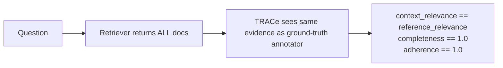

# Finding: V1 chunk_size is degenerate on CovidQA

**Date:** 2026-05-31
**Owner:** Shiva
**Tag:** `v1` `chunking` `covidqa`
**Status:** Documented; fix scheduled for V2 (chunking sweep) and V3 (per-domain chunk_size).

---

## Summary

V1's sliding-window chunker uses `chunk_size=256` words. On RAGBench's CovidQA subset, **0.0% of documents exceed 256 words**. As a result, every document becomes exactly one chunk. With 4 documents per example and `top_k=5`, the retriever returns *every* document — making the retrieval step a no-op, the metrics trivially saturate, and our scores match the reference perfectly for the wrong reason.

This is a **config-vs-data mismatch**, not a chunker bug. It is also a real, mentor-mandated finding ("a chunking strategy that works well for one domain may not work well for another" — Capstone brief §3.1).

---

## Evidence

```
covidqa: 1252 examples, 5008 total documents
  word count:  min=7  max=136  mean=90  median=106
  p90=119      p99=125
  pct docs > 256 words (would slide): 0.0%
  pct docs > 128 words: 0.2%
  pct docs >  64 words: 78.2%
```

V1 verbose run on n=2:

```
example 1  id=358  (6 relevant / 6 utilized sentence keys)
     chunk   0.00s  4 chunks from 4 docs    ← 1 chunk per doc
     index   0.13s  namespace=358  vectors=4  dim=384
  retrieve   0.04s  top_k=4                  ← top_k=5 requested, only 4 chunks exist
           #0 score=0.868 keys=[0a,0b,0c,0d,0e,0f]  Title: Emergent severe...
           #1 score=0.868 keys=[1a,1b,1c,1d,1e,1f]  Title: Emergent severe...
```

---

## Why metrics match the reference perfectly



When the retriever returns every available document, our chunk-level relevance count equals the reference's document-level count by definition. There is nothing for the retriever to get *wrong* — so V1 is testing the generator and evaluator only, not the retrieval pipeline.

This is fine for a **baseline** — V1's purpose per the experiment matrix is exactly to be the degenerate reference point that V2..V8 improve upon. But we must not report V1 numbers as evidence the retriever works.

---

## Cross-subset implications (untested — only covidqa is downloaded)

The proposal §3.1 brief and the RAGBench paper both note that other subsets have substantially longer documents:

| Subset       | Domain           | Expected doc length             | Will V1's 256-word window slide? |
|--------------|------------------|---------------------------------|-----------------------------------|
| covidqa      | biomedical       | ~100 words (verified)           | ❌ No — degenerate                 |
| pubmedqa     | biomedical       | abstracts, ~200 words (estimate)| 🟡 Marginal                       |
| hotpotqa     | general          | Wikipedia paras, ~50-200 words  | 🟡 Mostly degenerate              |
| msmarco      | general          | passages, ~100 words            | ❌ No — degenerate                 |
| cuad         | legal            | full contracts, 1000s of words  | ✅ Yes — slides                    |
| emanual      | customer-support | manual sections, 500+ words     | ✅ Yes — slides                    |
| techqa       | customer-support | forum posts, varied             | 🟡 Varies                         |
| finqa        | finance          | tables + report text, varied    | ✅ Yes — slides                    |
| tatqa        | finance          | tables + paragraphs, 500+       | ✅ Yes — slides                    |

**Action for Sunil (Week 2):** download remaining subsets and re-run this distribution analysis. The decision matrix below depends on those numbers.

---

## How to choose chunk_size from data (proposed methodology)

Three principles, in priority order:

### 1. Slide, don't degenerate
`chunk_size` must be small enough that a meaningful fraction of docs split into ≥2 chunks. Concretely: target ≥50% of documents producing >1 chunk. If <10% slide, chunking is a no-op for that subset.

```python
import numpy as np
arr = np.array([len(d.split()) for docs in df['documents'] for d in docs])
recommended_cs = int(np.percentile(arr, 30))   # 70% of docs slide
```

For covidqa this gives `chunk_size ≈ 64` (matches the 78.2%-slide row above).

### 2. Respect the embedder's context window
bge-small-en-v1.5 has a 512-token model limit. Word counts ≈ 0.7 × token counts on English text, so any `chunk_size` up to ~700 words is safe. Going much larger means embedding silently truncates and we lose tail content.

### 3. Sentence boundary alignment beats raw size
If sentences average N words, prefer `chunk_size = k·N` for integer k so most chunks contain whole sentences. RAGBench provides per-doc sentence annotations, so we can compute the median sentence length per subset:

```python
sent_lens = [len(s.text.split()) for docs in df['documents_sentences']
             for sents in docs for s in sents]
median_sent = np.median(sent_lens)   # ~16 for covidqa
```

`chunk_size = 4·median_sent` (≈64 for covidqa) gives chunks of roughly 4 sentences each — small enough to slide, large enough that each chunk is a coherent unit.

### Recommended per-domain defaults (proposal)

These are first-pass recommendations; V3 will tune empirically against TRACe scores.

| Subset       | chunk_size | overlap | Rationale                                   |
|--------------|-----------:|--------:|---------------------------------------------|
| covidqa      |         64 |      16 | p70(doc_len)≈64; ~4 sentences/chunk         |
| pubmedqa     |        128 |      24 | abstracts cluster around ~200 words         |
| msmarco      |         64 |      16 | passages similar to covidqa                  |
| hotpotqa     |         96 |      24 | paragraph-level docs                         |
| cuad         |        512 |      64 | long contracts; preserve clause context      |
| emanual      |        256 |      32 | match V1 default — sections are sized for it |
| techqa       |        256 |      32 | varied; baseline default reasonable          |
| finqa        |        384 |      48 | table + commentary blocks                    |
| tatqa        |        384 |      48 | table + commentary blocks                    |

---

## Plan

### V1 (now): document, don't change
- Add a comment in `configs/v1_baseline.yaml` flagging the covidqa-specific degeneracy.
- Reference this finding in [week_1_progress.md](../week_1_progress.md).
- Continue to use V1 as the baseline reference point for the matrix.

### V2 (Week 2): chunking sweep
- Run V1 with three chunkers — sliding (current), sentence-aware, semantic — on **all five domains**.
- For sliding, use the per-domain `chunk_size` from the table above.
- Report Δ(TRACe) vs V1 baseline.

### V3 (Week 2-3): per-domain chunk_size
- Holding chunker = best-from-V2 fixed, sweep `chunk_size` on a small grid per domain: `[median(doc), p70(doc), p90(doc), 256, 512]`.
- Goal: produce a defensible per-domain config rather than a one-size-fits-all.

### Schema for the per-domain config (target shape)
```yaml
# configs/v3_per_domain.yaml
chunker:
  kind: sentence_aware    # winner from V2
  per_domain:
    biomedical:       { chunk_size:  64, overlap: 16 }
    general:          { chunk_size:  96, overlap: 24 }
    legal:            { chunk_size: 512, overlap: 64 }
    customer-support: { chunk_size: 256, overlap: 32 }
    finance:          { chunk_size: 384, overlap: 48 }
```

The pipeline already keys configs on `data.subset` — extending it to look up per-domain chunker params is a ~10-line change.

---

## Lessons

1. **Always inspect data shape before tuning hyperparameters.** I had pulled the V1 256/32 numbers from "Searching for Best Practices in RAG" without validating against our actual dataset. One `df['documents'].str.split().str.len()` call would have caught this on day one.

2. **A perfect score against a reference is a smell, not a win.** When V1 matched reference scores exactly on the first 3 examples, my first instinct was "evaluator is correct" — but the real story was "retrieval is bypassed." Verbose mode (`-v` flag) made this immediately obvious by surfacing chunk counts and retrieved chunks side-by-side.

3. **Per-domain heterogeneity is what the capstone is *about*.** This finding strengthens the proposal's core thesis (mentor brief §3.1). It belongs in the final report's "what we learned" section, not buried as a config tweak.
