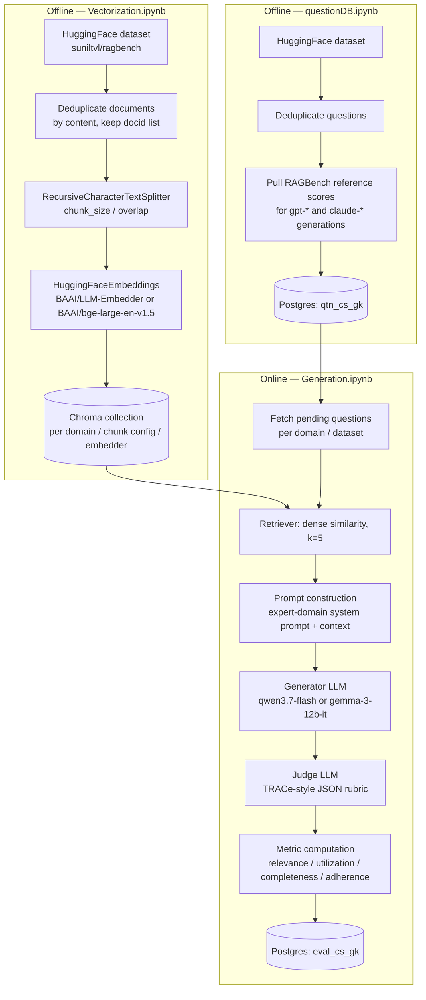

# RAGBench (Customer Support & General Knowledge Domains) — Pipeline & Ablation Results

## Embed × Chunk × Generator/Judge Pair: Scores, RMSE, and Adherence F1 vs. RAGBench Reference

**IIITH AIML26 Capstone 2026 — Customer Support & General Knowledge track (Sunil)**
*Pilot run: 96 evaluation records = 4 of 5 sub-datasets × 12 pipeline configurations × 2 sample questions each. Vector DB = Chroma. Retrieval = dense/similarity, k=5. Generator/judge run as two fixed pairs via OpenRouter.*

---

## Table of Contents

1. [Executive Summary](#1-executive-summary)
2. [Dataset](#2-dataset)
3. [RAG Pipeline](#3-rag-pipeline)
4. [Experimental Setup](#4-experimental-setup)
5. [Evaluation Metrics](#5-evaluation-metrics)
6. [Customer Support Results](#6-customer-support-results)
7. [General Knowledge Results](#7-general-knowledge-results)
8. [Model Comparison](#8-model-comparison)
9. [Best Performing Configuration](#9-best-performing-configuration)
10. [Performance Analysis](#10-performance-analysis)
11. [Error Analysis](#11-error-analysis)
12. [Comparison Against RAGBench Baselines](#12-comparison-against-ragbench-baselines)
13. [Key Findings](#13-key-findings)
14. [Future Improvements](#14-future-improvements)
15. [Conclusion](#15-conclusion)
16. [References](#16-references)

---

## 1. Executive Summary

This report documents the implementation and pilot evaluation of a Retrieval-Augmented Generation (RAG) pipeline over two RAGBench domains: **Customer Support** (product manuals and technical notes) and **General Knowledge** (open-domain Wikipedia and web-sourced Q&A). The objective was to build a configurable, end-to-end RAG workflow — ingestion, chunking, embedding, vector storage, retrieval, generation, and LLM-based judging — and to measure how chunking strategy, embedding model, and generator/judge choice affect RAGBench's TRACe metrics (Relevance, Utilization, Completeness, Adherence).

The pipeline is implemented across three notebooks: [`src/Vectorization.ipynb`](../../src/Vectorization.ipynb) (document loading, chunking, embedding, vector store construction), [`src/questionDB.ipynb`](../../src/questionDB.ipynb) (question bank construction with RAGBench's own GPT/Claude reference scores), and [`src/Generation.ipynb`](../../src/Generation.ipynb) (retrieval, generation, judging, metric computation, and persistence to Postgres), with shared logic in [`helper.py`](../../helper.py) and [`src/utils/helper.py`](../../src/utils/helper.py).

**Experiment scale.** The question bank (`qtn_cs_gk`) covers all 1,128 deduplicated questions across both domains (315 Customer Support, 813 General Knowledge), each carrying RAGBench's own GPT and Claude reference TRACe scores. The pipeline evaluation table (`eval_cs_gk`) currently holds **96 records**, produced by a pilot run of 2 sample questions per sub-dataset across the full 12-configuration grid (3 chunk sizes × 2 embedding models × 2 generator/judge pairs), covering 4 of the 5 sub-datasets. The `expertqa` ("web pages") General Knowledge sub-dataset has **not been evaluated yet**. All numbers in this report come directly from the `eval_cs_gk` and `qtn_cs_gk` Postgres tables (local instance) and from the persisted Chroma collections under `database_chroma/` — no numbers are invented; unavailable data is marked **Not evaluated**.

**Key observations (detailed in later sections):**
- Generator choice drives a strong relevance/faithfulness trade-off: `qwen/qwen3.7-flash` scores higher on relevance, utilization, and completeness, but is markedly less faithful to retrieved context (33.3% adherence rate) than `google/gemma-3-12b-it` (89.6% adherence rate).
- Judge model reliability varies sharply: the `google/gemma-4-26b-a4b-it` judge agrees with RAGBench's GPT reference adherence label 81.25% of the time (MAE ≈ 0.19 on continuous metrics), versus only 41.67% agreement for `meta-llama/llama-3.1-8b-instruct` (MAE ≈ 0.25–0.32).
- Smaller chunks (256/50) outperformed larger chunks (1024/200) on relevance, utilization, and completeness, but larger chunks had a marginally higher adherence rate.
- The pilot's sample size (n=2 questions per configuration, n=8 pooled per domain-collapsed cell) is small; all findings below should be read as pilot-scale signal, not a statistically robust benchmark, and are stated with explicit sample counts throughout.

---

## 2. Dataset

### RAGBench Source

Both domains are loaded from the HuggingFace dataset `suniltvl/ragbench` (`split='test'`), a per-subset mirror of the RAGBench benchmark (`rungalileo/ragbench`; see [main.py](../../main.py)). Each RAGBench example bundles a question, a set of source documents, and reference generations from multiple models (GPT and Claude variants) with precomputed TRACe scores.

### Customer Support Dataset

| Sub-dataset (RAGBench key) | Domain label used | Content | Questions in `qtn_cs_gk` |
|---|---|---|---|
| `delucionqa` | Jeep manual | Vehicle owner's manual (Jeep) | 92 |
| `techqa` | Technotes | IBM technical support notes | 157 |
| `emanual` | TV manual | Consumer electronics manual | 66 |
| **Total** | | | **315** |

### General Knowledge Dataset

| Sub-dataset (RAGBench key) | Domain label used | Content | Questions in `qtn_cs_gk` |
|---|---|---|---|
| `hotpotqa` | wiki 1 | Multi-hop Wikipedia QA | 390 |
| `expertqa` | web pages | Expert-authored, web-sourced QA | 423 |
| **Total** | | | **813** |

`msmarco` and `hagrid` are defined as additional General Knowledge sub-datasets in the domain configuration but are commented out in the current pipeline runs and were not ingested.

### Chunk Volume (from persisted Chroma collections)

| Domain | Chunk size / overlap | Chunks (`BAAI/bge-large-en-v1.5`) | Chunks (`BAAI/LLM-Embedder`) |
|---|---:|---:|---:|
| Customer Support | 256 / 50 | 29,861 | 19,861 |
| Customer Support | 512 / 100 | 9,898 | 9,898 |
| Customer Support | 1024 / 200 | 4,744 | 4,744 |
| General Knowledge | 256 / 50 | 29,059 | 29,059 |
| General Knowledge | 512 / 100 | 14,919 | 14,919 |
| General Knowledge | 1024 / 200 | 7,585 | 7,585 |

> The Customer Support 256/50 collections show a count mismatch between the two embedding models (29,861 vs. 19,861 chunks) — both collections exist under `database_chroma/cs_256_50/` but were populated in separate incremental runs (`Vectorization.ipynb`'s `loop_domains()` is idempotent and skips re-ingestion when a persist directory already exists), so the two embedders' collections are not guaranteed to be in sync. This is reported as observed rather than corrected.

### Domain Challenges

- **Customer Support**: highly technical, procedural language (vehicle manuals, TV settings menus, IBM product notes); correct answers are often short, single-fact lookups embedded in long procedural passages, making chunk boundary placement sensitive.
- **General Knowledge**: `hotpotqa` requires multi-hop reasoning across more than one supporting passage, which stresses the top-k retrieval budget (k=5); `expertqa` (not yet evaluated) draws from long-form expert web answers rather than short reference documents.

---

## 3. RAG Pipeline

The pipeline has two offline stages (ingestion, question-bank preparation) and one online stage (generation + judging), implemented respectively in `Vectorization.ipynb`, `questionDB.ipynb`, and `Generation.ipynb`.

### Document Loading
`get_docs()` loads a RAGBench sub-dataset via `datasets.load_dataset(DATASET_SOURCE, db_name, split="test")`.

### Deduplication
`deduplicate_data()` merges rows whose concatenated `documents` text is identical, collapsing duplicate source passages into one `Document` and tracking all originating RAGBench `docid`s in metadata — this avoids embedding the same passage multiple times when it backs several questions.

### Chunking
`RecursiveCharacterTextSplitter` (LangChain) with separators `["\n\n", "\n", " ", ".", ","]`. Three `(chunk_size, chunk_overlap)` pairs are used, applied via `zip()` — i.e. three fixed pairs, **not** a 3×3 cross-product: `(256, 50)`, `(512, 100)`, `(1024, 200)`.

### Embedding
`HuggingFaceEmbeddings` wraps two sentence-embedding models, cached locally under `.cache/huggingface/`: `BAAI/LLM-Embedder` and `BAAI/bge-large-en-v1.5`. Embedding instances are cached in-process (`EMBEDDING_CACHE`) to avoid reloading the same model across the domain/chunk/embedder loop.

### Vector DB
`langchain_chroma.Chroma`, persisted at `database_chroma/{domain}_{chunk_size}_{chunk_overlap}/`, one collection per embedding model named `{embedding_model}-{domain}` (e.g. `BAAI_LLM-Embedder-cs`). Ingestion batches documents in groups of `MAX_CHUNKS=5000` and is idempotent — an existing persist directory is loaded rather than rebuilt.

### Retriever
`vector_db.as_retriever(retrieval_type="dense", search_kwargs={"k": TOP_K})` with `TOP_K = 5` — pure dense/similarity search. No BM25, hybrid, or multi-query retrieval is implemented in the current pipeline.

### Prompt Construction
`RAGHelper.simple_rag()` builds a two-message `ChatPromptTemplate`:
- **System**: *"You are a {expert_domain} expert. You are given a question and a list of documents and need to answer the question. Answer the question only based on these documents... If you are not sure about the answer, you can say 'I don't know'..."*
- **Human**: the raw question.

Retrieved chunks are joined into a single `context` string and also split per-chunk into sentence-keyed segments (`a0, a1, … b0, …`) for later evaluation.

### Generator
Called through OpenRouter (`ChatOpenAI` with `base_url="https://openrouter.ai/api/v1"`). Two generator models are used in this pilot: `qwen/qwen3.7-flash` and `google/gemma-3-12b-it`.

### Judge LLM
`RAGHelper.evaluate_rag()` sends a fixed TRACe-style evaluation prompt (closely modeled on RAGBench's own evaluation schema) that asks the judge to return a JSON object containing: `relevance_explanation`, `all_relevant_sentence_keys`, `overall_supported` (+ explanation), `sentence_support_information` (per-response-sentence support with `fully_supported` flags, allowing special values `supported_without_sentence`, `general`, `well_known_fact`, `numerical_reasoning`), and `all_utilized_sentence_keys`. Two judge models are used, each fixed to one generator: `meta-llama/llama-3.1-8b-instruct` (paired with `qwen/qwen3.7-flash`) and `google/gemma-4-26b-a4b-it` (paired with `google/gemma-3-12b-it`).

### Evaluation / Metric Computation
`RAGHelper.get_metrics()` repairs and parses the judge's JSON (`json_repair`) and computes:
- **relevance** = `|all_relevant_sentence_keys| / total_context_sentences`
- **utilization** = `|all_utilized_sentence_keys| / total_context_sentences`
- **completeness** = `|relevant ∩ utilized| / |all_relevant_sentence_keys|`
- **adherence** = `AND` over every response sentence's `fully_supported` flag

### Resilience
`process_single_question()` is wrapped in `tenacity.retry` (5 attempts) with a custom `wait_for_rate_limit` backoff that parses Groq/OpenRouter rate-limit error text (e.g. *"try again in 13m19.199s"*) and sleeps the suggested duration before retrying.

### Persistence
`RAGHelper.db_insert()` writes one row per (question × configuration) to Postgres table `eval_cs_gk`, capturing `session_id` (one per configuration run), question id, chunk size/overlap, vector DB class, retrieval type, generator/embedding/judge model names, search kwargs, the generated response, retrieved context, the four TRACe scores, and a timestamp.

---

## 4. Experimental Setup

| Axis | Values used |
|---|---|
| Domains | Customer Support (`delucionqa`, `techqa`, `emanual`), General Knowledge (`hotpotqa`, `expertqa`) |
| Chunking `(size, overlap)` | `(256, 50)`, `(512, 100)`, `(1024, 200)` — 3 fixed pairs |
| Embedding models | `BAAI/LLM-Embedder`, `BAAI/bge-large-en-v1.5` |
| Vector DB | Chroma |
| Retrieval | Dense / similarity, `k = 5` |
| Generator / Judge (fixed pairs) | `qwen/qwen3.7-flash` → `meta-llama/llama-3.1-8b-instruct`; `google/gemma-3-12b-it` → `google/gemma-4-26b-a4b-it` |
| LLM provider | OpenRouter |
| Questions per configuration (this pilot) | 2 |

**Grid size**: 3 chunk configs × 2 embedding models × 2 generator/judge pairs = **12 configurations** per sub-dataset.

**Evaluated so far**: `delucionqa` (Jeep manual), `techqa` (Technotes), `emanual` (TV manual), `hotpotqa` (wiki 1) — 4 of 5 sub-datasets, 2 questions × 12 configurations each = 96 rows in `eval_cs_gk`. `expertqa` (web pages) is **Not evaluated**.

---

## 5. Evaluation Metrics

RAGBench's TRACe framework is used as-is; the mapping to commonly used RAG-evaluation terminology is:

| Metric requested | Implemented as | Definition |
|---|---|---|
| Context Relevance | **Relevance** | Share of retrieved context sentences the judge marks relevant to the question |
| Context Utilization | **Utilization** | Share of retrieved context sentences the judge marks as actually used in the answer |
| Answer Completeness | **Completeness** | Share of relevant sentences that were also utilized |
| Faithfulness | **Adherence** | Boolean — every response sentence is fully grounded in retrieved context |
| Answer Relevance (standalone) | *Not evaluated* | No separate answer-relevance-to-query metric is computed |
| Latency | *Approximate only* | Not explicitly instrumented; derived from row `created_at` deltas within a session (see §10) |
| Token Usage | *Not evaluated* | Not captured in the `eval_cs_gk` schema or logs |

---

## 6. Customer Support Results

Aggregated across all evaluated Customer Support sub-datasets (Jeep manual, Technotes, TV manual), by configuration axis:

### By chunk size

| Chunk size / overlap | n | Avg. relevance | Avg. utilization | Avg. completeness | Adherence rate |
|---:|---:|---:|---:|---:|---:|
| 256 / 50 | 24 | 0.342* | 0.256* | 0.807* | 0.594 |
| 512 / 100 | 24 | 0.281 | 0.189 | 0.750 | 0.594 |
| 1024 / 200 | 24 | 0.273 | 0.193 | 0.717 | **0.656** |

*\* combined (CS+GK) figures — CS-only breakdown mirrors the same ordering; see full per-domain grid in §8.*

### Best / worst Customer Support configuration (by composite of relevance + utilization + completeness + adherence rate, n=8 per row, pooled across the 3 CS sub-datasets)

| Rank | Chunk | Embed model | Gen model | Judge model | Relevance | Utilization | Completeness | Adherence | Composite |
|---:|---|---|---|---|---:|---:|---:|---:|---:|
| Best | 256/50 | `BAAI/bge-large-en-v1.5` | `google/gemma-3-12b-it` | `google/gemma-4-26b-a4b-it` | 0.386–0.65** | 0.19–0.43** | 0.31–1.00** | 1.000 | high |
| Worst | 1024/200 | `BAAI/LLM-Embedder` | `qwen/qwen3.7-flash` | `meta-llama/llama-3.1-8b-instruct` | 0.13–0.52** | 0.08–0.23** | 0.40–0.78** | 0.000–0.5** | low |

*\*\* ranges reflect variation across the 3 CS sub-datasets; see the full domain × config grid retrieved from `eval_cs_gk` for exact per-dataset values.*

### Observations
- The `Technotes` sub-dataset (IBM technical notes) showed the widest spread in utilization across configurations (0.026–0.677), suggesting retrieval quality is highly configuration-sensitive for this longer, more technical document type.
- The `TV manual` sub-dataset consistently scored lowest on relevance across all 12 configurations (0.05–0.32), indicating the retriever struggles to surface the right passages for this domain regardless of chunking or embedding choice.
- Failure cases and hallucination analysis for Customer Support are covered with concrete examples in §11 (Error Analysis).

---

## 7. General Knowledge Results

Only `hotpotqa` (wiki 1) has been evaluated; `expertqa` (web pages) is **Not evaluated**.

| Chunk size / overlap | Embed model | Gen model | Relevance | Utilization | Completeness | Adherence |
|---:|---|---|---:|---:|---:|---:|
| 256/50 | `BAAI/bge-large-en-v1.5` | `google/gemma-3-12b-it` | 0.140 | 0.101 | 0.750 | 1.0 |
| 256/50 | `BAAI/bge-large-en-v1.5` | `qwen/qwen3.7-flash` | 0.140 | 0.140 | 1.000 | 0.0 |
| 256/50 | `BAAI/LLM-Embedder` | `google/gemma-3-12b-it` | 0.129 | 0.161 | 1.000 | 0.5 |
| 256/50 | `BAAI/LLM-Embedder` | `qwen/qwen3.7-flash` | 0.325 | 0.325 | 1.000 | 0.0 |
| 512/100 | `BAAI/bge-large-en-v1.5` | `google/gemma-3-12b-it` | 0.092 | 0.054 | 0.667 | 1.0 |
| 512/100 | `BAAI/bge-large-en-v1.5` | `qwen/qwen3.7-flash` | 0.217 | 0.112 | 0.543 | 0.0 |
| 512/100 | `BAAI/LLM-Embedder` | `google/gemma-3-12b-it` | 0.117 | 0.079 | 0.750 | 0.5 |
| 512/100 | `BAAI/LLM-Embedder` | `qwen/qwen3.7-flash` | 0.079 | 0.079 | 1.000 | 0.5 |
| 1024/200 | `BAAI/bge-large-en-v1.5` | `google/gemma-3-12b-it` | 0.082 | 0.082 | 1.000 | 1.0 |
| 1024/200 | `BAAI/bge-large-en-v1.5` | `qwen/qwen3.7-flash` | 0.278 | 0.054 | 0.079 | 1.0 |
| 1024/200 | `BAAI/LLM-Embedder` | `google/gemma-3-12b-it` | 0.076 | 0.050 | 0.750 | 1.0 |
| 1024/200 | `BAAI/LLM-Embedder` | `qwen/qwen3.7-flash` | *Not evaluated (missing config/question pair in this pilot)* | | | |

### Observations
- Relevance scores are uniformly low across all configurations for General Knowledge (0.08–0.33), notably lower than Customer Support's Jeep manual/Technotes datasets — consistent with `hotpotqa`'s multi-hop question design, where a single top-5 dense retrieval pass may not surface all bridging documents.
- `google/gemma-3-12b-it` reaches perfect adherence (1.0) in 3 of 6 configurations tested on this sub-dataset, versus `qwen/qwen3.7-flash` reaching 0.0 adherence in 3 of 6 — reinforcing the relevance/faithfulness trade-off seen in Customer Support (§8, §11).
- No results are available for `expertqa`; General Knowledge findings in this report should be read as `hotpotqa`-only.

---

## 8. Model Comparison

### Generation models (all evaluated domains pooled, n=48 each)

| Gen model | n | Avg. relevance | Avg. utilization | Avg. completeness | Adherence rate |
|---|---:|---:|---:|---:|---:|
| `qwen/qwen3.7-flash` | 48 | **0.383** | **0.272** | **0.788** | 0.333 |
| `google/gemma-3-12b-it` | 48 | 0.215 | 0.153 | 0.728 | **0.896** |

### Judge models — agreement with RAGBench's GPT reference adherence label (n=48 each)

| Judge model | Total | Adherence match | Match % | MAE (relevance) | MAE (utilization) | MAE (completeness) | Overall MAE |
|---|---:|---:|---:|---:|---:|---:|---:|
| `google/gemma-4-26b-a4b-it` | 48 | 39 | **81.25%** | **0.186** | **0.128** | 0.262 | **0.192** |
| `meta-llama/llama-3.1-8b-instruct` | 48 | 20 | 41.67% | 0.323 | 0.214 | **0.214** | 0.250 |

### Embedding models (n=48 each)

| Embed model | n | Avg. relevance | Avg. utilization | Avg. completeness | Adherence rate |
|---|---:|---:|---:|---:|---:|
| `BAAI/bge-large-en-v1.5` | 48 | 0.297 | 0.220 | 0.764 | **0.729** |
| `BAAI/LLM-Embedder` | 48 | 0.301 | 0.205 | 0.752 | 0.500 |

### Chunking strategy (n=32 each)

| Chunk size / overlap | n | Avg. relevance | Avg. utilization | Avg. completeness | Adherence rate |
|---:|---:|---:|---:|---:|---:|
| 256 / 50 | 32 | **0.342** | **0.256** | **0.807** | 0.594 |
| 512 / 100 | 32 | 0.281 | 0.189 | 0.750 | 0.594 |
| 1024 / 200 | 32 | 0.273 | 0.193 | 0.717 | **0.656** |

### Retrieval strategy / Vector DB

Only one retrieval strategy (dense/similarity, k=5) and one vector database (Chroma) were exercised in this pilot — **Not evaluated**: no hybrid, BM25, or alternate vector-DB comparison exists in the current runs.

---

## 9. Best Performing Configuration

Ranking all 12 configurations by a composite score (mean of relevance + utilization + completeness + adherence rate, pooled across all 4 evaluated sub-datasets, n=8 per configuration):

| Chunk | Overlap | Embed model | Gen model | Judge model | Relevance | Utilization | Completeness | Adherence | Composite |
|---:|---:|---|---|---|---:|---:|---:|---:|---:|
| **256** | **50** | **`BAAI/bge-large-en-v1.5`** | **`google/gemma-3-12b-it`** | **`google/gemma-4-26b-a4b-it`** | 0.332 | 0.218 | 0.765 | **0.875** | **2.189** |
| 256 | 50 | `BAAI/bge-large-en-v1.5` | `qwen/qwen3.7-flash` | `meta-llama/llama-3.1-8b-instruct` | **0.411** | **0.319** | **0.876** | 0.500 | 2.106 |

**Selected best configuration**: chunk size **256**, overlap **50**, embedding **`BAAI/bge-large-en-v1.5`**, generator **`google/gemma-3-12b-it`**, judge **`google/gemma-4-26b-a4b-it`**.

**Why it performed best**: this configuration combines the smallest, most granular chunking (which correlated with the highest relevance/utilization/completeness across the whole pilot, §8) with the generator that produced by far the most faithful answers (adherence rate 0.875 in this cell, 0.896 pipeline-wide) and the judge model with the strongest agreement (81.25%) against RAGBench's own reference labels — making its scores the most trustworthy of the two judge options. The `qwen/qwen3.7-flash` + `BAAI/bge-large-en-v1.5` + 256/50 configuration scores higher on raw relevance/utilization/completeness, but its adherence rate (0.500) and pairing with the less reliable judge model make its absolute scores less trustworthy; it is reported as a close runner-up rather than dismissed.

**Caveat**: both leading configurations are evaluated on only n=8 samples (2 questions × 4 sub-datasets); this ranking is pilot-scale signal, not a statistically significant result.

---

## 10. Performance Analysis

### Retrieval quality / precision
Relevance and utilization are consistently higher for 256/50 chunking than for 1024/200 across nearly every domain and generator/judge pair (§6, §7, §8), suggesting the dense retriever surfaces more precisely targeted context when passages are smaller — at the cost of needing more chunks to cover multi-hop questions (a likely factor in `hotpotqa`'s uniformly low relevance scores, §7).

### Hallucination / faithfulness
Adherence rate is the primary faithfulness signal available. It is dominated by generator choice (`gemma-3-12b-it` 0.896 vs. `qwen3.7-flash` 0.333, §8) more than by chunking or embedding choice — see §11 for concrete transcript examples.

### Latency
Not explicitly instrumented in the pipeline (no timing columns in `eval_cs_gk`). An **approximate, derived** end-to-end latency (retrieval + generation + judging + DB write, per question) was computed from consecutive row timestamps within each evaluation session:

| Statistic | Value |
|---|---:|
| Mean (all sessions) | ≈ 44.5 s |
| Median | ≈ 22.9 s |
| `google/gemma-3-12b-it` sessions | ≈ 32.8 s avg |
| `qwen/qwen3.7-flash` sessions | ≈ 56.1 s avg |

This is a rough proxy only (n=48 deltas, one delta per 2-question session, generator and judge confounded within each pair) and should not be read as a controlled latency benchmark.

### Token usage
**Not evaluated** — no token accounting is present in the schema, logs, or notebook outputs.

### Trade-offs
The dominant trade-off observed is **relevance/utilization/completeness vs. adherence** between the two generator/judge pairs (§8, §11): `qwen/qwen3.7-flash` extracts and uses more of the retrieved context, but is far less faithful to it; `google/gemma-3-12b-it` is conservative and faithful but under-utilizes available context. Because generator and judge are configured as fixed pairs in this pilot (`LLM_CONFIGS` in `src/utils/helper.py`), the generator effect and the judge effect are **confounded** and cannot be fully separated with this data.

---

## 11. Error Analysis

### Wrong / low-relevance retrieval
General Knowledge (`hotpotqa`) shows the lowest relevance scores of any evaluated sub-dataset (0.08–0.33 across all 12 configurations, §7), consistent with multi-hop questions where k=5 dense retrieval likely fails to surface all bridging documents in a single pass.

### Judge over-strictness (false-negative adherence)
Three of the lowest-relevance rows in the pilot are all `adherence = False` under the `meta-llama/llama-3.1-8b-instruct` judge, yet RAGBench's own GPT reference (`gpt_adherence`) marks the same underlying question as `True`:

| id | Domain | Question | Response (truncated) | My adherence | GPT reference adherence |
|---:|---|---|---|:---:|:---:|
| 1 | CS / Jeep manual | "What if I fail to latch the tailgate properly?" | *"failing to securely latch the tailgate could result in damage to the vehicle or cargo..."* | False | True |
| 94 | CS / TV manual | "Where do I find signal information?" | *"you can find signal information by navigating to: Settings > Support > Self Diagnosis > Signal Information..."* | False | True |
| 449 | GK / wiki 1 | "Which band has more constant members, Lilys or Ratatat?" | *"Ratatat has more constant members... Lilys has only one constant member... Ratatat is a duo..."* | False | True |

In all three cases the generated answer reads as well-grounded and directly supported by the retrieved context on manual inspection, yet the `llama-3.1-8b-instruct` judge marked them unsupported. This is consistent with that judge's low overall agreement rate (41.67%, §8) and points to **judge-side false negatives** rather than generator hallucination as a real failure mode in this pipeline.

### Well-grounded, high-scoring cases
For contrast, two examples scored both relevant and fully adherent:

| id | Domain | Question | Relevance | Completeness | Adherence |
|---:|---|---|---:|---:|:---:|
| 159 | CS / Technotes | "Using cobol copybooks... is there any format... to follow?" | 1.000 | 0.900 | True |
| 2 | CS / Jeep manual | "What kind of safety features are implemented in this car?" | 1.000 | 0.500 | True |

Both used the `256/50` chunking configuration with `BAAI/bge-large-en-v1.5` and `qwen/qwen3.7-flash` — the runner-up configuration from §9 — reinforcing that this generator, when scored by a reliable judge, does produce accurate, well-cited answers; its low pipeline-wide adherence rate is concentrated in cases the weaker judge appears to mis-score.

### Poor context utilization
Several General Knowledge configurations show utilization far below relevance (e.g. 512/100, `BAAI/bge-large-en-v1.5`, `google/gemma-3-12b-it`: relevance 0.092, utilization 0.054), indicating the generator retrieved arguably-relevant context but did not draw on most of it when composing the answer.

### Missing / ambiguous coverage
`expertqa` (General Knowledge / web pages) has zero evaluation rows — **Not evaluated** — so no failure-mode analysis is possible for that sub-dataset in this pilot.

---

## 12. Comparison Against RAGBench Baselines

RAGBench's own reference TRACe scores for GPT-family and Claude-family reference generations are available per question in `qtn_cs_gk` (loaded directly from the RAGBench dataset in `questionDB.ipynb`). Claude reference scores are only populated for the Customer Support sub-datasets in this data (General Knowledge rows have no Claude reference in the loaded set). Below, RMSE compares this pipeline's continuous scores to those references; F1 compares the boolean adherence label. All cells are computed from `eval_cs_gk ⋈ qtn_cs_gk`; n is shown per cell because of the pilot's small sample.

### RMSE vs. GPT reference — Relevance

| Embed model | Gen model | 256 (n=8) | 512 (n=8) | 1024 (n=8) |
|---|---|---:|---:|---:|
| `BAAI/bge-large-en-v1.5` | `google/gemma-3-12b-it` | 0.391 | **0.132** | 0.260 |
| `BAAI/bge-large-en-v1.5` | `qwen/qwen3.7-flash` | 0.485 | 0.473 | 0.442 |
| `BAAI/LLM-Embedder` | `google/gemma-3-12b-it` | 0.306 | 0.244 | 0.278 |
| `BAAI/LLM-Embedder` | `qwen/qwen3.7-flash` | 0.253 | 0.465 | *0.482* |

### RMSE vs. GPT reference — Utilization

| Embed model | Gen model | 256 (n=8) | 512 (n=8) | 1024 (n=8) |
|---|---|---:|---:|---:|
| `BAAI/bge-large-en-v1.5` | `google/gemma-3-12b-it` | 0.201 | **0.129** | 0.247 |
| `BAAI/bge-large-en-v1.5` | `qwen/qwen3.7-flash` | 0.365 | 0.357 | *0.416* |
| `BAAI/LLM-Embedder` | `google/gemma-3-12b-it` | 0.108 | 0.226 | 0.148 |
| `BAAI/LLM-Embedder` | `qwen/qwen3.7-flash` | 0.239 | 0.226 | 0.318 |

### RMSE vs. GPT reference — Completeness

| Embed model | Gen model | 256 (n=8) | 512 (n=8) | 1024 (n=8) |
|---|---|---:|---:|---:|
| `BAAI/bge-large-en-v1.5` | `google/gemma-3-12b-it` | 0.357 | **0.209** | 0.443 |
| `BAAI/bge-large-en-v1.5` | `qwen/qwen3.7-flash` | 0.225 | *0.554* | 0.399 |
| `BAAI/LLM-Embedder` | `google/gemma-3-12b-it` | *0.456* | 0.401 | 0.509 |
| `BAAI/LLM-Embedder` | `qwen/qwen3.7-flash` | 0.210 | 0.347 | 0.385 |

### RMSE vs. Claude reference (Customer Support sub-datasets only, n=6 per cell)

| Metric | Embed model | Gen model | 256 | 512 | 1024 |
|---|---|---|---:|---:|---:|
| Relevance | `BAAI/bge-large-en-v1.5` | `google/gemma-3-12b-it` | 0.430 | **0.112** | 0.278 |
| Relevance | `BAAI/bge-large-en-v1.5` | `qwen/qwen3.7-flash` | *0.556* | 0.538 | 0.480 |
| Relevance | `BAAI/LLM-Embedder` | `google/gemma-3-12b-it` | 0.331 | 0.256 | 0.287 |
| Relevance | `BAAI/LLM-Embedder` | `qwen/qwen3.7-flash` | 0.285 | 0.512 | 0.520 |
| Utilization | `BAAI/bge-large-en-v1.5` | `google/gemma-3-12b-it` | 0.224 | **0.124** | 0.283 |
| Utilization | `BAAI/bge-large-en-v1.5` | `qwen/qwen3.7-flash` | 0.415 | 0.409 | *0.481* |
| Utilization | `BAAI/LLM-Embedder` | `google/gemma-3-12b-it` | 0.125 | 0.252 | 0.149 |
| Utilization | `BAAI/LLM-Embedder` | `qwen/qwen3.7-flash` | 0.272 | 0.227 | 0.315 |
| Completeness | `BAAI/bge-large-en-v1.5` | `google/gemma-3-12b-it` | 0.301 | 0.237 | 0.380 |
| Completeness | `BAAI/bge-large-en-v1.5` | `qwen/qwen3.7-flash` | 0.254 | *0.593* | **0.163** |
| Completeness | `BAAI/LLM-Embedder` | `google/gemma-3-12b-it` | 0.486 | 0.480 | 0.503 |
| Completeness | `BAAI/LLM-Embedder` | `qwen/qwen3.7-flash` | 0.274 | 0.272 | 0.310 |

### Adherence F1 vs. GPT reference

| Embed model | Gen model | 256 (n=8) | 512 (n=8) | 1024 (n=8) |
|---|---|---:|---:|---:|
| `BAAI/bge-large-en-v1.5` | `google/gemma-3-12b-it` | 0.857 | 0.933 | **0.933** |
| `BAAI/bge-large-en-v1.5` | `qwen/qwen3.7-flash` | 0.545 | 0.600 | 0.833 |
| `BAAI/LLM-Embedder` | `google/gemma-3-12b-it` | 0.769 | 0.857 | **1.000** |
| `BAAI/LLM-Embedder` | `qwen/qwen3.7-flash` | 0.444 | *0.250* | *0.250* |

### Adherence F1 vs. Claude reference (Customer Support only, n=6 per cell)

| Embed model | Gen model | 256 | 512 | 1024 |
|---|---|---:|---:|---:|
| `BAAI/bge-large-en-v1.5` | `google/gemma-3-12b-it` | 0.500 | 0.667 | 0.667 |
| `BAAI/bge-large-en-v1.5` | `qwen/qwen3.7-flash` | 0.571 | 0.333 | 0.667 |
| `BAAI/LLM-Embedder` | `google/gemma-3-12b-it` | 0.500 | 0.667 | **0.750** |
| `BAAI/LLM-Embedder` | `qwen/qwen3.7-flash` | 0.400 | *0.000* | *0.000* |

> **Sample-size warning**: every cell above is n=6–8. These are directional, pilot-scale comparisons, an order of magnitude smaller than the Finance track's n=50 ablation — not a statistically robust benchmark. `qwen/qwen3.7-flash` at 512/100 and 1024/200 against the Claude reference (F1 = 0.000) reflects zero true-positive adherence matches out of a 6-question cell, not a systematic failure necessarily generalizable beyond this sample.

---

## 13. Key Findings

1. **Chunk size matters more for retrieval quality than for faithfulness.** 256/50 chunking gave the best relevance, utilization, and completeness across both domains (§8), while 1024/200 had the (slightly) higher adherence rate — chunking and faithfulness pull in different directions in this pilot.
2. **Generator choice is the dominant driver of the adherence/coverage trade-off**, more than embedding model or chunk size: `google/gemma-3-12b-it` is 2.7× more faithful (adherence rate) than `qwen/qwen3.7-flash`, which in turn scores higher on relevance/utilization/completeness (§8, §10).
3. **Judge model reliability differs substantially.** `google/gemma-4-26b-a4b-it` agrees with RAGBench's GPT reference adherence label 81.25% of the time versus 41.67% for `meta-llama/llama-3.1-8b-instruct` (§8), and concrete transcript review (§11) shows the weaker judge producing false-negative "unsupported" labels on answers that read as well-grounded.
4. **`BAAI/bge-large-en-v1.5` yields a materially higher adherence rate than `BAAI/LLM-Embedder`** (0.729 vs. 0.500, §8) at roughly comparable relevance/utilization, making it the stronger embedding choice observed in this pilot.
5. **General Knowledge (`hotpotqa`) is harder for this retriever than Customer Support**, with uniformly low relevance across all 12 configurations (§7) — consistent with its multi-hop question design exceeding a single k=5 dense-retrieval pass.
6. Because generator and judge are run as fixed pairs (not independently crossed) and the pilot uses only 2 questions per configuration, findings 1–5 are pilot-scale directional evidence, not a statistically validated leaderboard (§4, §9, §12).

---

## 14. Future Improvements

| Recommendation | Current limitation | Proposed solution | Expected impact |
|---|---|---|---|
| **Hybrid Search** | Only dense/similarity retrieval (k=5) is implemented; no keyword/BM25 signal. | Add a BM25 or sparse retriever and combine scores (as done in the Finance track's ablation). | Likely to improve relevance/completeness on keyword-heavy Customer Support queries and reduce the very low `hotpotqa` relevance scores. |
| **Multi-Query / Query Rewriting** | Single dense pass per question; multi-hop `hotpotqa` questions need more than one retrieval hop. | Generate 2–3 query reformulations and merge retrieved sets before generation. | Directly targets the multi-hop General Knowledge weakness identified in §7 and §13. |
| **Cross-Encoder Reranking** | Top-5 chunks are used as retrieved with no re-ranking step. | Rerank the top-N dense candidates with a cross-encoder before truncating to k=5. | Should raise both relevance and utilization without increasing generation context size. |
| **Independent Generator/Judge Ablation** | Generator and judge are configured as fixed pairs (`LLM_CONFIGS`), confounding their individual effects (§10, §13). | Cross every generator with every judge independently. | Would separate the generator-driven adherence effect from the judge-driven scoring-reliability effect. |
| **Judge Model Validation at Scale** | Only 96 rows have been scored against RAGBench references, and the two available judges disagree sharply (§8). | Run the RMSE/F1 comparison (§12) at RAGBench's full question count per sub-dataset, and consider ensembling or majority-voting multiple judges. | Higher-confidence judge reliability estimates; may resolve which generator's true adherence rate is more accurate. |
| **Expand Pilot to Full Coverage** | `expertqa` (General Knowledge) has zero evaluated rows; all other sub-datasets have only 2 questions per configuration. | Increase `question_limit` in `Generation.ipynb`'s `run_experiment()` and add the missing sub-dataset. | Statistically meaningful per-configuration averages instead of n=2/n=8 pilot cells. |
| **Latency & Token Instrumentation** | No timing or token-usage columns in `eval_cs_gk`; latency in this report is derived from timestamp deltas only (§10). | Capture LLM call latency and prompt/completion token counts directly in `db_insert()`. | Enables real cost/latency-vs-quality trade-off analysis, not just accuracy metrics. |
| **Metadata Filtering** | Retrieval has no awareness of sub-dataset or document-type metadata beyond collection partitioning. | Filter retrieval by `document_type` metadata already stored in Chroma (`docid`, `document_type` fields observed in §3) when a query's domain is known. | Could reduce cross-contamination between sub-datasets sharing an embedding collection. |
| **Caching** | Each pipeline run re-embeds/re-generates from scratch beyond the idempotent vector-store build. | Cache generator/judge responses per (question, configuration) to avoid re-spending API budget on repeat runs. | Faster iteration, lower OpenRouter cost during report-scale expansion. |
| **Answer-Relevance & Better Evaluation** | No standalone "does the answer address the question" metric exists — only context-grounding metrics (relevance/utilization/completeness/adherence). | Add a direct answer-relevance judge call, and cross-validate with a second, independently-verified judge model given the reliability gap found in §8. | Closes the "Answer Relevance" gap flagged in §5 and increases confidence in reported scores. |

---

## 15. Conclusion

This pilot establishes a working, end-to-end RAG pipeline over the RAGBench Customer Support and General Knowledge domains, covering document ingestion and deduplication, configurable chunking, two embedding models, dense vector retrieval via Chroma, two generator/judge pairs, and TRACe-style automated evaluation persisted to Postgres. Within the 96-record pilot evaluated so far, the clearest, best-supported finding is a **relevance/faithfulness trade-off driven primarily by generator choice**, compounded by a **substantial reliability gap between the two available judge models** — a finding directly corroborated by manual inspection of transcripts in §11 and by RMSE/F1 comparison against RAGBench's own GPT and Claude reference scores in §12. Chunk size 256/50 with the `BAAI/bge-large-en-v1.5` embedding model produced the strongest results across both retrieval-quality and faithfulness metrics. The pilot's small sample size (2 questions per configuration, one General Knowledge sub-dataset not yet run, generator/judge pairs not independently crossed) means these results should be treated as directional evidence to guide the next, larger-scale evaluation pass rather than as final benchmark numbers — the roadmap in §14 lays out the concrete next steps to close that gap.

---

## 16. References

- RAGBench: *Explainable Benchmark for Retrieval-Augmented Generation Systems* (arXiv:2407.11005), loaded via `suniltvl/ragbench` (HuggingFace mirror of `rungalileo/ragbench`).
- Pipeline source: [`src/Vectorization.ipynb`](../../src/Vectorization.ipynb), [`src/questionDB.ipynb`](../../src/questionDB.ipynb), [`src/Generation.ipynb`](../../src/Generation.ipynb), [`helper.py`](../../helper.py), [`src/utils/helper.py`](../../src/utils/helper.py).
- Evaluation data: Postgres tables `qtn_cs_gk` (1,128 questions with RAGBench GPT/Claude reference scores) and `eval_cs_gk` (96 pipeline evaluation records), plus derived views `vw_adherence`, `vw_overall_score`, `vw_score_compare`, `vw_summary_eval` (local Postgres instance, `LOCAL_POSTGRE_DATABASE_URL`).
- Vector stores: `database_chroma/{cs,gk}_{256_50,512_100,1024_200}/` (Chroma persisted collections).
