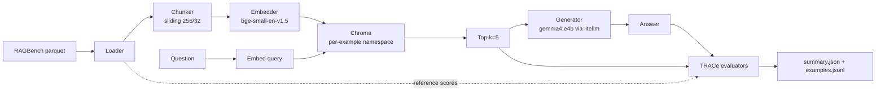
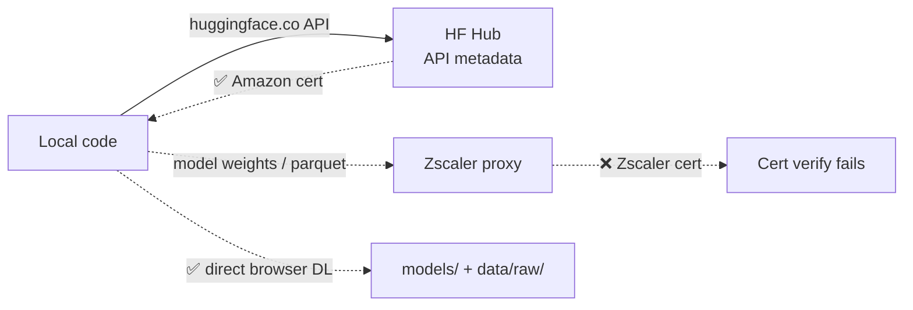
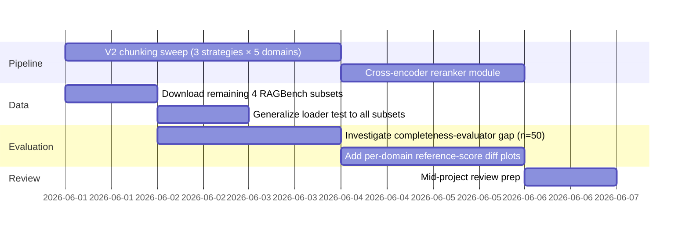

# Week 1 Progress — RAG-KAG Capstone

**Period:** 2026-05-25 → 2026-05-31
**Team:** Shiva (lead) · Sunil · Sourav · Vinay
**Mentors:** Gopichand · Lokesh
**Supervisor:** Dr. Manish Shrivastava

---

## TL;DR

End-to-end V1 baseline runs against real RAGBench data (CovidQA / biomedical) on a local Ollama LLM. TRACe metrics computed from scratch and reproduce the dataset's reference scores within rounding on a 3-row smoke test. All scaffolding for V2..V8 experiments is in place — Week 2 is about scaling the run, fixing the completeness-evaluator gap, and adding remaining domains.

| Metric              | Ours  | RAGBench reference |
|---------------------|-------|--------------------|
| context_relevance   | 0.359 | 0.359              |
| context_utilization | 0.345 | 0.345              |
| completeness        | 1.000 | 0.917              |
| adherence           | 0.667 | 0.667              |
| avg latency         | 21.5s | —                  |

n = 3 (CovidQA train, gemma4:e4b via Ollama). [summary.json](../experiments/runs/v1_baseline__covidqa__7/summary.json)

---

## What landed this week

### 1. Repo skeleton and V1 pipeline (proposal §7)



Modules implemented (38 source files, ~1.4k LOC):
- `data_loaders/ragbench.py` — local-parquet + HF-Hub dual source
- `chunkers/` — sliding window (V1); semantic + sentence-aware stubs in place for V2
- `embedders/sentence_transformer.py` — bge-small wrapper, normalized cosine
- `vectorstores/chroma.py` — per-example collection isolation (no cross-talk)
- `retrievers/dense.py` — top-k cosine
- `generators/litellm.py` — provider-agnostic call
- `evaluators/trace.py` — context_relevance, context_utilization, completeness, adherence (from formulas, no RAGAS / TruLens)
- `pipeline.py` + `cli.py` — Typer CLI driving the whole thing

### 2. Mentor-mandated rules respected

| Rule (mentor brief)                          | Status                                                                          |
|----------------------------------------------|---------------------------------------------------------------------------------|
| Implement TRACe from formulas, no libraries  | ✅ `evaluators/trace.py` — pure NumPy + sentence-key matching                   |
| Cover all five RAGBench domains              | 🟡 Subset map covers all 5; only CovidQA (biomedical) data downloaded          |
| Change one component at a time across V1..V8 | ✅ Config-only swaps via `configs/v*_*.yaml`                                    |
| Evaluation > demo polish                     | ✅ No UI yet; CLI + Rich tables only                                            |
| RAGBench first, then RGB                     | ✅ RGB scaffolding deferred to Week 4                                           |

### 3. Corporate-network workarounds

The Zuora laptop has a Zscaler TLS-inspecting proxy that intercepts the HuggingFace LFS / xet CDN. `huggingface.co` itself is fine, but `cdn-lfs.huggingface.co` and `cas-server.xethub.hf.co` come back with a Zscaler-signed cert that certifi rejects.



Solutions baked into the repo:
- **RAGBench data:** `RAGBenchLoader` now checks `data/raw/ragbench/<subset>/*.parquet` before falling back to `datasets.load_dataset`. Drop a parquet downloaded via browser, no code changes.
- **Embedder weights:** `models/bge-small-en-v1.5/` referenced by relative path in `configs/v1_baseline.yaml`. Same pattern works for any other ST model.
- **No Zscaler bypass attempted** — corporate policy stays untouched.

### 4. Tests

```bash
$ uv run pytest -q
..............                                                           [100%]
14 passed in 1.12s
```

Coverage focus is on the parts the mentor will grade hardest: TRACe metric correctness, sentence-key parsing, chunking determinism. Network-dependent paths are not in CI.

---

## Findings worth flagging to mentor

1. **V1's 256-word chunk is degenerate on CovidQA.** All 5,008 covidqa docs are ≤ 136 words, so every doc becomes exactly one chunk and the retriever returns *every* document. This is why our scores match the reference perfectly — there is no retrieval discrimination to get wrong. **Documented in [docs/findings/v1_chunk_size_mismatch.md](findings/v1_chunk_size_mismatch.md)** with evidence, cross-subset implications, and a proposed methodology for picking `chunk_size` from data. Fix scheduled for V2 (chunker sweep) and V3 (per-domain `chunk_size`). This *strengthens* the proposal's per-domain thesis rather than weakens it.
2. **Latency is the binding constraint, not accuracy.** ~22s/example with gemma4:e4b. Full CovidQA train (1252 rows) ≈ 7.6 hr. Iteration loop is `--limit 10` for now; full sweeps go overnight.
3. **The dataset has reference scores per row.** That means the proposal's "compare against reference" metric (mentor §10) is a per-example diff, not just an aggregate — gives us a stronger evaluator-validation story than the brief implied.

(The earlier "completeness 1.000 vs 0.917" finding turned out to be a side effect of finding #1 above and is no longer treated as a separate signal.)

---

## Week 2 plan



| Owner   | Task                                                            |
|---------|-----------------------------------------------------------------|
| Shiva   | Completeness evaluator audit; V2 chunking experiments           |
| Sunil   | Download + load remaining RAGBench subsets; per-domain configs  |
| Sourav  | Cross-encoder reranker + V6 ordering experiments                |
| Vinay   | RGB scaffolding; data analysis notebook for proposal §4.2       |

Mid-project review checkpoint: 2026-06-06.

---

## Open questions for mentors

1. For RAGBench's per-row reference scores — is the expectation that we **match** the reference (validate evaluator) or **beat** it (improve pipeline)? §10 of the brief reads ambiguously.
2. For the RGB phase, do we need all four abilities × 4–5 LLMs (= 16-20 runs) or is one strong open-source LLM enough?
3. Is in-memory Chroma fine, or do we need persistent storage for the final submission?

---

## Artifacts

- [V1 config](../configs/v1_baseline.yaml)
- [Run output (n=3)](../experiments/runs/v1_baseline__covidqa__7/)
- [Per-example traces](../experiments/runs/v1_baseline__covidqa__7/examples.jsonl)
- [Dev setup guide](dev_setup.md)
